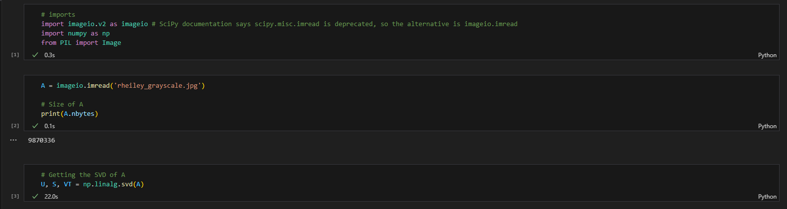
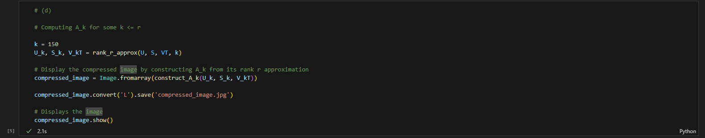

# MATH307 Project Question 2

# Group 1


Install the necessary dependencies by running the following command in the terminal:

```bash
pip install -r requirements.txt
```

Ensure your code editor is compatible with Jupyter Notebooks to run each cell.

Expected Output:





